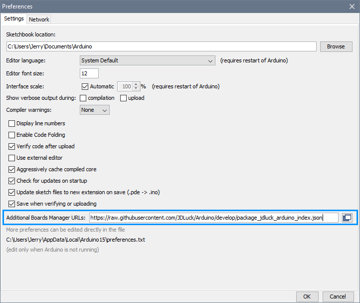
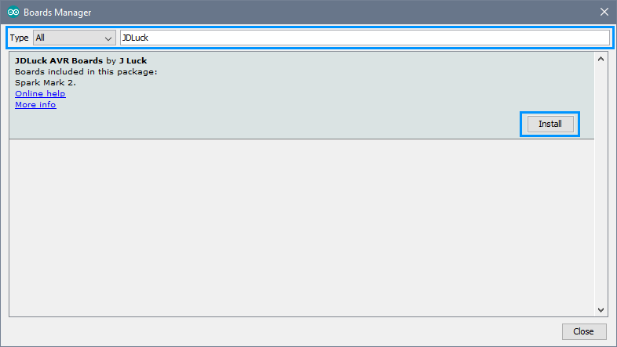
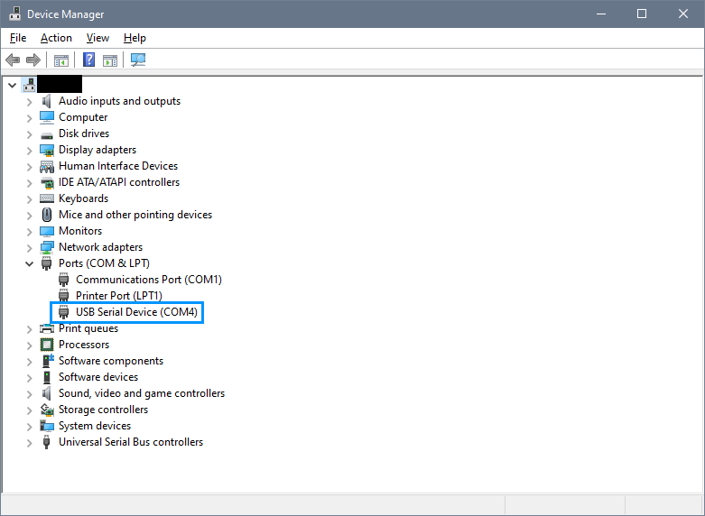

# JDLuck Arduino Boards

#### AVR Boards
* [Spark Mark 2]

### Installation & Setup Instructions 

Start Arduino and open the Preferences window (**File** > **Preferences**).  
Copy and paste the following URL into the 'Additional Boards Manager URLs' input field:

	https://raw.githubusercontent.com/JDLuck/Arduino/master/package_jdluck_arduino_index.json

If a URL already exists in the above field, click the button at the right end of the field. This will open an editing window allowing you to paste the above URL onto a new line.

In the Arduino IDE, open the 'Boards Manager' dialog (**Tools** > **Board** > **Boards Manager...**)  
Select a search type of 'All' and filter for 'JDLuck'. Click the 'JDLuck AVR Boards' package entry and then 'Install'.

In the Arduino IDE, select the appropriate board to target, an example for the Spark Mark 2;  
(**Tools** > **Board** > **JDLuck Spark Mark 2**)

In the Arduino IDE, ensure that you have selected the correct COM port to target, as an example for the Spark Mark 2;  
(**Tools** > **Port** > **COM4 (JDLuck Spark Mk. 2)**) 
 
You can find the COM port number in 'Device Manager' on windows if you are unsure.

You should now be ready to 'Verify' and 'Upload' your sketch.